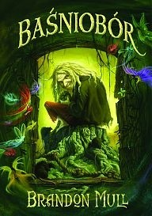
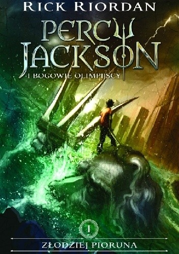
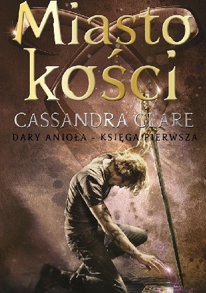

# Zadanie-3-grafika-www
<h1>Lista moich 5 ulubionych książek</h1> 
<h2>Spis treści</h2>
<ul>
<li>Baśniobór</li>
<li>Percy Jackson i bogowie olimpijscy</li>
<li>Dary Anioła</li>
<li>Akademia dobra i zła</li>
<li>Intruz</li>
</ul>
<ol>
<li><b><h2>Baśniobór</h2></b></li>

Kendra i Seth zostają wysłani na dwa tygodnie do dziadka. I wcale nie są zadowoleni. Na przywitanie dostają mnóstwo przestróg. Dzieci nie mają pojęcia, że ten dziwny staruszek jest strażnikiem tajemniczego Baśnioboru. W pilnowanym przez niego lesie żyją ze sobą w zgodzie zachłanne trolle, figlarne satyry, zgryźliwe czarownice, psotne chochliki i zazdrosne wróżki. Rodzeństwo, zlekceważywszy zakazy dziadka, uwalnia groźne siły zła, którym teraz trzeba stawić czoło. By uratować rodzinę, Baśniobór, a może nawet cały świat, Kendra będzie musiała zdobyć się na to, czego obawia się najbardziej...

Tu można sprawdzić gdzie kupić <a href="https://lubimyczytac.pl/ksiazka/85361/basniobor" title="Baśniobór"> Baśniobór</a>

<li><b><h2>Percy Jackson i bogowie olimpijscy</h2></b></li>

Co by było, gdyby olimpijscy bogowie żyli w XXI wieku? Co by było, gdyby nadal zakochiwali się w śmiertelnikach i śmiertelniczkach i mieli z nimi dzieci, z których mogliby wyrosnąć wielcy herosi – jak Tezeusz, Jazon czy Herakles? Jak to jest – być takim dzieckiem? To właśnie przydarzyło się dwunastoletniemu Percy’emu Jacksonowi, który zaraz po tym, jak dowiedział się prawdy, wyruszył w niezwykle niebezpieczną misję. Z pomocą satyra i córki Ateny Percy odbędzie podróż przez całe Stany Zjednoczone, żeby schwytać złodzieja, który ukradł przedwieczną „broń masowego rażenia” – należący do Zeusa piorun piorunów. Po drodze zmierzy się z zastępami mitologicznych potworów, których zadaniem jest go powstrzymać. A przede wszystkim będzie musiał stawić czoła ojcu, którego nigdy wcześniej nie spotkał, oraz przepowiedni, która ostrzegła go przed…

Tu można sprawdzić gdzie kupić <a href="https://lubimyczytac.pl/ksiazka/298431/zlodziej-pioruna" title="Percy Jackson i bogowie olimpijscy"> Percy Jackson i bogowie olimpijscy</a>

<li><b><h2>Dary anioła</h2></b></li>

Być świadkiem morderstwa – to przeżycie, które pozostawia w psychice ślad na całe życie. Clary Fray wiedze życie normalnej, nieco zbuntowanej nastolatki. Gdy jednak pewnego razu w klubie staje się świadkiem bezwzględnego morderstwa popełnionego przez trzech nastolatków na ich rówieśniku, jej dotychczasowa rzeczywistość kompletnie się rozpada.

Tu można sprawdzić gdzie kupić <a href="https://lubimyczytac.pl/ksiazka/4807935/miasto-kosci?" title="Dary anioła"> Dary anioła</a>

<li><b><h2>Akademia dobra i zła</h2></b></li>

Tego roku, najlepsze przyjaciółki Sophie i Agatha dowiedzą się dokąd trafiają po skończeniu trzynastu lat wszystkie zaginione dzieci. Do legendarnej Akademi Dobra i Zła, w której zwyczajni chłopcy i zwykłe dziewczynki są szkolone by zostać albo bajkowymi bohaterami, albo wielkimi złoczyńcami. Sophie, najładniejsza dziewczyna w całym Gavaldonie całe dotychczasowe życie marzyła żeby zostać już porwaną i trafić do zaczarowanego świata. Ze swoimi różowymi sukienkami, dobrymi stopniami i skłonnością do dobrych uczynków, wie, że ma szansę dostać się do szkoły Dobra i w efekcie zostać księżniczką z bajek. Z kolei Agatha gustująca w mrocznych strojach i czarnych kotach, pełna niechęci do wszystkich napotkanych na jej drodze istot, myśli, że trafi do szkoły Zła. Tymczasem staje sie zupełnie inaczej...

Tu można sprawdzić gdzie kupić <a href="https://lubimyczytac.pl/ksiazka/248047/akademia-dobra-i-zla" title="Akademia dobra i zła"> Akademia dobra i zła</a>

<li><b><h2>Intruz</h2></b></li>

Świat został opanowany przez niewidzialnego wroga. Najeźdźcy przejęli ludzkie ciała oraz umysły i wiodą w nich normalne życie. Jedną z ostatnich niezasiedlonych, wolnych istot ludzkich jest Melanie. Wpada jednak w ręce wroga, a w jej ciele zostaje umieszczona dusza o imieniu Wagabunda. Intruz bada myśli poprzedniej właścicielki ciała w poszukiwaniu śladów prowadzących do reszty rebeliantów...

Tu można sprawdzić gdzie kupić <a href="https://lubimyczytac.pl/ksiazka/174518/intruz" title="Intruz"> Intruz</a>

